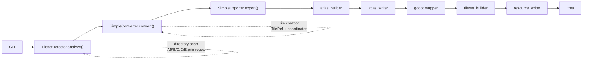

# RPG Maker 2 Godot

CLI tool written in Python 3.13+ to convert RPG Maker MV/MZ tilesets into Godot resources.

## Development

Create the virtual environment:

```bash
python -m venv .venv
```

Activate it and install the project:

```bash
python -m pip install -e .
```

Run:

```bash
rpgmaker2godot
```

### Architecture
```text
src/rpgmaker2godot/
├── cli.py                          # CLI entry point (main) — reads Tilesets.json to resolve collisions
├── analysis/                       # PNG sheet detection (TilesetDetector)
│   ├── detector.py, models.py
├── conversion/                     # AnalysisResult → internal model transformation
│   └── converter.py                # SimpleConverter
├── tileset/                        # Reading/parsing of RPG Maker flags
│   ├── reader.py                   # TilesetsJsonReader
│   ├── flags.py                    # decode_tile_flags() — 16-bit decoding
│   ├── model.py                    # TileProperties, TilesetFlags
│   ├── resolver.py                 # TilePropertiesResolver
│   ├── collision.py                # tile_properties_to_collision()
│   └── tile_id.py                  # TileRef → global Tile ID conversion
├── model/                          # Shared internal model (immutable)
│   ├── enums.py, sheet.py, tile.py, tileset.py, tile_collision.py
├── atlas/                          # PNG atlas building and writing
│   ├── builder.py, models.py, writer.py
├── image/                          # Image extraction (PIL/Pillow)
│   ├── extractor.py, source.py
├── utils/                          # Console messages (rich banner)
└── godot/                          # Godot resource generation
    ├── model.py                    # Godot models (GodotTileSet, etc.)
    ├── atlas/                      # atlas_builder.py, atlas_mapper.py
    ├── tileset/                    # collision.py (GodotTileCollision), tileset_builder.py
    ├── resource/                   # resource.py, resource_serializer.py, resource_writer.py
    ├── export/                     # simple.py (SimpleExporter — orchestrator)
    └── collision/                  # tile_collision.py (has_collision — guards the semantic/geometry boundary)
```

### Logging

The pipeline is silent by default. Drop a `logging.json` file into the working directory to enable debug logging (raw flags, decoded properties and generated polygons, tile by tile). Records are written **to the configured file only** — never to the console:

```json
{
  "enabled": true,
  "level": "DEBUG",
  "file": "rpgmaker2godot.log",
  "mode": "OVERWRITE"
}
```

* `enabled`: master switch;
* `level`: minimum severity (`DEBUG`, `INFO`, `WARNING`, `ERROR`);
* `file`: **required** — the sole destination of the records; without this field, logging stays disabled;
* `mode`: `APPEND` (default) appends records at the end of the existing file, `OVERWRITE` recreates the file on every run — any missing or unknown value falls back to `APPEND`.

### Windows executable

A standalone binary is generated in `dist\rpgmaker2godot.exe` (all dependencies — Pillow, rich — are bundled, no Python interpreter required on the target machine):

```powershell
pip install -e ".[build]"
powershell -ExecutionPolicy Bypass -File scripts\build_exe.ps1
```

The build recipe is described by the versioned `rpgmaker2godot.spec` file (onefile, console, package metadata embedded for the banner).

Every generation **automatically increments the numeric `build` entry** of the `[project]` section of `pyproject.toml`; this number is displayed by the banner right after the version: `rpgmaker2godot v0.1.0 build 35`.

* slower first startup: the executable extracts itself into `%TEMP%`;
* unsigned binary: SmartScreen or your antivirus may show a warning when running it.

### Conversion pipeline
RPG Maker → Godot conversion pipeline

