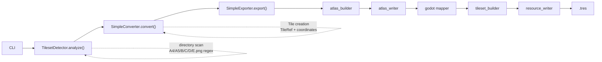
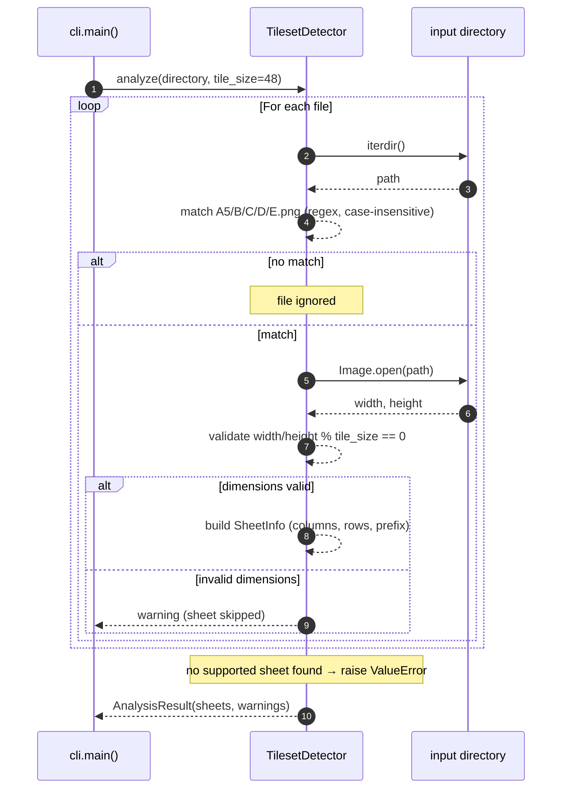
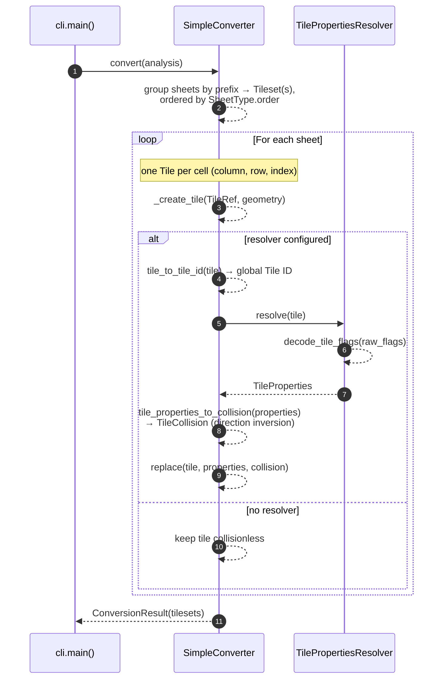
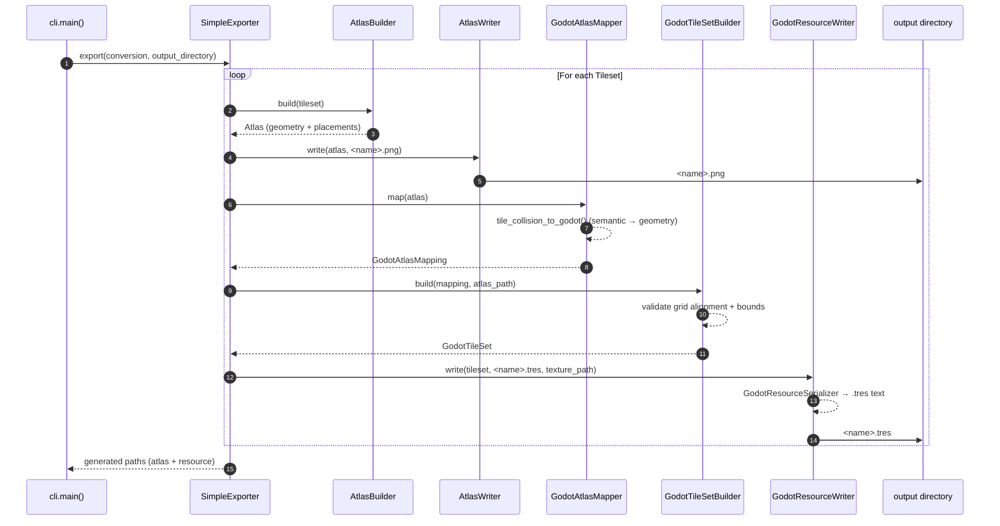

# RPG Maker 2 Godot

CLI tool written in Python 3.13+ to convert RPG Maker MV/MZ tilesets into Godot resources.

## Development

Create the virtual environment:

```bash
python -m venv .venv
```

Activate it and install the project:

```bash
python -m pip install -e .
```

Run:

```bash
rpgmaker2godot
```

### Linting and type checking

Install the development extras (`ruff` + `mypy`):

```bash
python -m pip install -e ".[dev]"
```

Lint with ruff (checks the whole repository, using the rules configured in `[tool.ruff]`):

```bash
python -m ruff check
```

Apply ruff's automatic fixes (`--fix`, `--unsafe-fixes` for the broader ones) before committing:

```bash
python -m ruff check --fix
python -m ruff check --fix --unsafe-fixes
```

Type-check with mypy (targets `src/rpgmaker2godot`, as configured in `[tool.mypy]`):

```bash
python -m mypy
```

### Architecture
```text
src/rpgmaker2godot/
├── cli.py                          # CLI entry point (main) — reads Tilesets.json to resolve collisions
├── analysis/                       # PNG sheet detection (TilesetDetector)
│   ├── detector.py                 # TilesetDetector: scans the input directory for RPG Maker sheets
│   │                               #   (A4/A5/B/C/D/E.png), validates their dimensions against the tile
│   │                               #   size and produces an AnalysisResult
│   └── models.py                   # SheetInfo, AnalysisResult, RPGMakerVersion — analysis data model
├── conversion/                     # AnalysisResult → internal model transformation
│   └── converter.py                # SimpleConverter
├── tileset/                        # Reading/parsing of RPG Maker flags
│   ├── reader.py                   # TilesetsJsonReader
│   ├── flags.py                    # decode_tile_flags() — 16-bit decoding
│   ├── model.py                    # TileProperties, TilesetFlags
│   ├── resolver.py                 # TilePropertiesResolver
│   ├── collision.py                # tile_properties_to_collision()
│   ├── tile_id.py                  # TileRef → global Tile ID conversion
│   └── autotile/                   # RPG Maker autotile composition
│       ├── shapes.py               # FLOOR_AUTOTILE_TABLE (48) + WALL_AUTOTILE_TABLE (16), verbatim
│       ├── composer.py             # compose 48x48 tiles from 24x24 quarters + unfold
│       └── a4.py                   # map the 48 A4 autotiles to source regions and shape quarters
├── model/                          # Shared internal model (immutable)
│   ├── enums.py                    # SheetType enum + its canonical stacking order (A4, A5, B, C, D, E)
│   ├── sheet.py                    # Sheet — one source tilesheet together with its extracted tiles
│   ├── tile.py                     # Tile + TileRef — one tile with its geometry, optional RPG Maker
│   │                               #   properties and derived collision
│   ├── tileset.py                  # Tileset + ConversionResult — group of sheets assembled together
│   └── tile_collision.py           # TileCollision — directional passage blocking, free of any Godot concept
├── atlas/                          # PNG atlas building and writing
│   ├── builder.py                  # AtlasBuilder: stacks a tileset's sheets into a single atlas geometry
│   ├── models.py                   # Atlas + AtlasPlacement — atlas model with each tile's coordinates
│   └── writer.py                   # AtlasWriter: renders an internal Atlas to a PNG image
├── image/                          # Image extraction (PIL/Pillow)
│   ├── extractor.py                # TileExtractor: crops a single Tile out of an ImageSource
│   └── source.py                   # ImageSource: lazy access to an image file (open/close, context manager)
├── utils/                          # Console messages (rich banner)
└── godot/                          # Godot resource generation
    ├── model.py                    # Godot models (GodotTileSet, etc.)
    ├── atlas/                      # atlas_builder.py, atlas_mapper.py
    ├── tileset/                    # collision.py (GodotTileCollision), tileset_builder.py
    ├── resource/                   # resource.py, resource_serializer.py, resource_writer.py
    ├── export/                     # simple.py (SimpleExporter — orchestrator)
    └── collision/                  # tile_collision.py (has_collision — guards the semantic/geometry boundary)
```

### Logging

The pipeline is silent by default. Drop a `logging.json` file into the working directory to enable debug logging (raw flags, decoded properties and generated polygons, tile by tile). Records are written **to the configured file only** — never to the console:

```json
{
  "enabled": true,
  "level": "DEBUG",
  "file": "rpgmaker2godot.log",
  "mode": "OVERWRITE"
}
```

* `enabled`: master switch;
* `level`: minimum severity (`DEBUG`, `INFO`, `WARNING`, `ERROR`);
* `file`: **required** — the sole destination of the records; without this field, logging stays disabled;
* `mode`: `APPEND` (default) appends records at the end of the existing file, `OVERWRITE` recreates the file on every run — any missing or unknown value falls back to `APPEND`.

> Running the test-suite never writes to this file: every test executes in an isolated working directory, so an ambient `logging.json` left next to the sources is invisible to the application under test.

### Windows executable

A standalone binary is generated in `dist\rpgmaker2godot.exe` (all dependencies — Pillow, rich — are bundled, no Python interpreter required on the target machine):

```powershell
pip install -e ".[build]"
powershell -ExecutionPolicy Bypass -File scripts\build_exe.ps1
```

The build recipe is described by the versioned `rpgmaker2godot.spec` file (onefile, console, package metadata embedded for the banner).

Every generation **automatically increments the numeric `build` entry** of the `[tool.rpgmaker2godot]` table of `pyproject.toml`; this number is displayed by the banner right after the version: `rpgmaker2godot v0.1.0 build 35`.

Once the executable is built, the script **packages the GitHub release archive** into `dist\`:

* `RpgMaker2Godot-win-x64-v{VERSION}{BUILD}.zip` — e.g. `RpgMaker2Godot-win-x64-v0.1.035.zip` — containing `rpgmaker2godot.exe` (additional assets such as sample tilesets can be added to the archive via the build script's staging step);
* `RpgMaker2Godot-win-x64-v{VERSION}{BUILD}.zip.sha256` — its SHA256 checksum, in `<hash>  <filename>` format.

`VERSION` is the `[project].version` from `pyproject.toml` and `BUILD` the freshly incremented build number.

The executable embeds the application icon (`assets/icon/rpgmaker2godot.ico`, also shipped as standalone PNGs from 512 down to 16 px). To tweak the artwork, edit `scripts/generate_icon.py`, regenerate with `python scripts/generate_icon.py`, then rebuild.

It also carries Windows version metadata (description, file & product version including the build number, product name, French language, copyright, original filename), defined once in `rpgmaker2godot.spec` from the `pyproject.toml` values.

* slower first startup: the executable extracts itself into `%TEMP%`;
* unsigned binary: SmartScreen or your antivirus may show a warning when running it.

### RPG Maker tileset structure

Reference for the sheet format handled by the pipeline, as defined by RPG Maker MV/MZ and its core script (`rmmz_core.js`).

**Objective.** A tileset is not a single image: `Tilesets.json` references up to nine PNG *sheets* (`A1`–`A5`, `B`–`E`) which the engine draws stacked on top of each other (A4 and A5 underneath, then the overlay layers `B` → `C` → `D` → `E`). Everything is laid out on a **48×48 px grid**: one tile is 48×48 px, and autotiles are composed from four **24×24 px quarters**. Sheets come in two families:

* **normal sheets** (`A5`, `B`–`E`) — every cell is an independent, ready-to-draw tile;
* **autotile sheets** (`A1`–`A4`) — cells are raw material: for every map cell the engine picks a *shape* from hardcoded tables (`FLOOR_AUTOTILE_TABLE` = 48 shapes, `WALL_AUTOTILE_TABLE` = 16, `WATERFALL_AUTOTILE_TABLE` = 4) and assembles the final 48×48 tile from four 24×24 quarters. This tool performs that composition at conversion time (*unfolding*), so Godot only sees plain static tiles.

**Organisation, number and size of tiles:**

| Sheet | Pixels | Content | Engine IDs | Purpose |
| ----- | ------ | ------- | ---------- | ------- |
| A1 | 768×576 | 16 autotiles | 768 | animated water and waterfalls |
| A2 | 768×576 | 32 autotiles | 1536 | ground autotiles (grass, paths…) |
| A3 | 768×576 | 32 autotiles | 1536 | building autotiles (roofs, walls) |
| A4 | 768×720 | 48 autotiles → 2304 unfolded tiles | 2304 | interior walls & ceilings (houses, caves, castles, dungeons) |
| A5 | 384×768 | 128 normal tiles (8×16) | 512 (128 used) | plain ground without autotile |
| B–E | 768×768 each | 256 normal tiles (16×16) each | 256 each | ordinary tiles, four overlay layers (B lowest → E highest) |

Global tile IDs are fixed by the engine — `B=0, C=256, D=512, E=768, A5=1536, A1=2048, A2=2816, A3=4352, A4=5888`, `TILE_ID_MAX=8192` — which is how the `Tilesets.json` flags array is matched to tiles.

**A4 layout in detail** (fully unfolded by the converter):

```text
768×720 px = 8 columns of 96 px × 3 bands of 240 px; each band stacks one
Wall Top row over one Wall Side row:

  y =   0..144    Wall Top  ×8   (96×144, FLOOR_AUTOTILE_TABLE, 48 shapes)
  y = 144..240    Wall Side ×8   (96×96,  WALL_AUTOTILE_TABLE,  16 shapes)
  y = 240..384    Wall Top  ×8
  y = 384..480    Wall Side ×8
  y = 480..624    Wall Top  ×8
  y = 624..720    Wall Side ×8
```

That gives 24 Wall Tops + 24 Wall Sides = 48 autotiles (`TILE_ID_A4 = 5888`; `kind % 16 < 8` ⇒ Wall Top). Each kind reserves 48 shape IDs — Wall Sides cycle through their 16 shapes — hence the **2304 ready-to-place 48×48 tiles** the converter unfolds per A4 sheet.

**What this tool converts:** `*_A4.png` (unfolded), `*_A5.png` and `*_B/C/D/E.png`. Sheets A1–A3 are not converted yet.

### Conversion pipeline

RPG Maker → Godot conversion pipeline:



The pipeline is split in three phases, orchestrated by `rpgmaker2godot.cli.main()`.

#### 1. Analysis — `analysis/`

`TilesetDetector.analyze()` scans the input directory for supported RPG Maker sheets (`A4.png`, `A5.png`, `B.png`, `C.png`, `D.png`, `E.png`, matched case-insensitively and optionally prefixed, e.g. `world_B.png`). For each sheet it validates that both dimensions are divisible by the tile size (48 px by default), then produces an `analysis.SheetInfo` per sheet and wraps them in an `analysis.AnalysisResult`:

* detects the dimensions, column/row count and tile size of every sheet;
* collects non-fatal issues as warnings (e.g. an unsupported/invalid PNG) without aborting the whole scan;
* raises `ValueError` if no supported sheet is found at all.



#### 2. Conversion — `conversion/`, `tileset/`

`SimpleConverter.convert()` turns the `AnalysisResult` into the internal, immutable `ConversionResult` model. Sheets sharing the same filename prefix are grouped into one `Tileset` and ordered by their canonical stacking order (A4, A5, B, C, D, E).

This prefix grouping is the default **merging** behaviour: every sheet sharing a prefix ends up stacked in a single atlas/`.tres`. Passing `--no-merge` keeps the source sheet split instead — each detected sheet becomes its own `Tileset`, named after the sheet file itself (so `world_B.png` yields a `world_B` tileset), and the export step then emits one `<sheet>.png` + `<sheet>.tres` per input sheet.

For every sheet, one `Tile` is created per cell:

* a `TileRef` (tileset name, sheet type, zero-based column-major index) plus its coordinates;
* **collision resolution** — when a `TilePropertiesResolver` is configured (i.e. a `Tilesets.json` is present), the tile's `TileRef` is mapped to the RPG Maker global Tile ID via `tile_to_tile_id()` (`B=0, C=256, D=512, E=768, A5=1536, A4=5888`, then row/column offset; for A4 the offset is `kind × 48 + shape`), the flags are decoded into `TileProperties`, and `tile_properties_to_collision()` converts the directional passage permissions into a Godot-agnostic `TileCollision`. Without a resolver the tile is kept collisionless, preserving the original behaviour.



#### 3. Export — `atlas/`, `image/`, `godot/`

`SimpleExporter.export()` writes, for each `Tileset`, a PNG atlas and a Godot `.tres` resource into the output directory:

1. `AtlasBuilder.build()` stacks the tileset's sheets into a single atlas geometry (`Atlas`), recording each tile's source and atlas coordinates.
2. `AtlasWriter.write()` renders that atlas to `<name>.png` by cropping each tile from its source sheet (`image/`'s `TileExtractor`/`ImageSource` handle the per-tile image access).
3. `GodotAtlasMapper.map()` translates the atlas into Godot's atlas model.
4. `GodotTileSetBuilder.build()` produces the `GodotTileSet` (tile shapes, source regions, collisions).
5. `GodotResourceWriter.write()` serializes it to the `<name>.tres` resource (Godot text-format), referencing the atlas texture.

The output directory therefore receives, per tileset: `<name>.png` (atlas) and `<name>.tres` (Godot resource).

