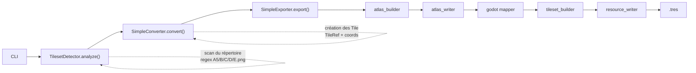

# RPG Maker 2 Godot

CLI tool written in Python 3.13+ to convert RPG Maker MV/MZ tilesets into Godot resources.

## Development

Create the virtual environment:

```bash
python -m venv .venv
```

Activate it and install the project:

```bash
python -m pip install -e .
```

Run:

```bash
rpgmaker2godot
```

### Architecture
```text
src/rpgmaker2godot/
├── cli.py                          # Point d'entrée CLI (main) — lit Tilesets.json pour résoudre les collisions
├── analysis/                       # Détection des feuilles PNG (TilesetDetector)
│   ├── detector.py, models.py
├── conversion/                     # Transformation AnalysisResult → modèle interne
│   └── converter.py                # SimpleConverter
├── tileset/                        # Lecture/analyse des drapeaux RPG Maker
│   ├── reader.py                   # TilesetsJsonReader
│   ├── flags.py                    # decode_tile_flags() — décodage des 16 bits
│   ├── model.py                    # TileProperties, TilesetFlags
│   ├── resolver.py                 # TilePropertiesResolver
│   ├── collision.py                # tile_properties_to_collision()
│   └── tile_id.py                  # Conversion TileRef → global Tile ID
├── model/                          # Modèle interne partagé (immuable)
│   ├── enums.py, sheet.py, tile.py, tileset.py, tile_collision.py
├── atlas/                          # Construction et écriture d'atlases PNG
│   ├── builder.py, models.py, writer.py
├── image/                          # Extraction d'images (PIL/Pillow)
│   ├── extractor.py, source.py
├── utils/                          # Messages console (banner rich)
└── godot/                          # Génération des ressources Godot
    ├── model.py                    # Modèles Godot (GodotTileSet, etc.)
    ├── atlas/                      # atlas_builder.py, atlas_mapper.py
    ├── tileset/                    # collision.py (GodotTileCollision), tileset_builder.py
    ├── resource/                   # resource.py, resource_serializer.py, resource_writer.py
    ├── export/                     # simple.py (SimpleExporter — orchestrateur)
    └── collision/                  # tile_collision.py (has_collision — garde la frontière sémantique/géométrie)
```

### Logging

Le pipeline est silencieux par défaut. Déposez un fichier `logging.json` dans le répertoire d'exécution pour activer les logs de débogage (drapeaux bruts, propriétés décodées et polygones générés, tuile par tuile). Les enregistrements sont écrits **uniquement dans le fichier configuré** — jamais dans la console :

```json
{
  "enabled": true,
  "level": "DEBUG",
  "file": "rpgmaker2godot.log"
}
```

* `enabled` : interrupteur principal ;
* `level` : sévérité minimale (`DEBUG`, `INFO`, `WARNING`, `ERROR`) ;
* `file` : **requis** — destination unique des enregistrements ; sans ce champ, les logs restent désactivés.

### Pipeline de conversion
Pipeline de conversion RPG Maker → Godot

